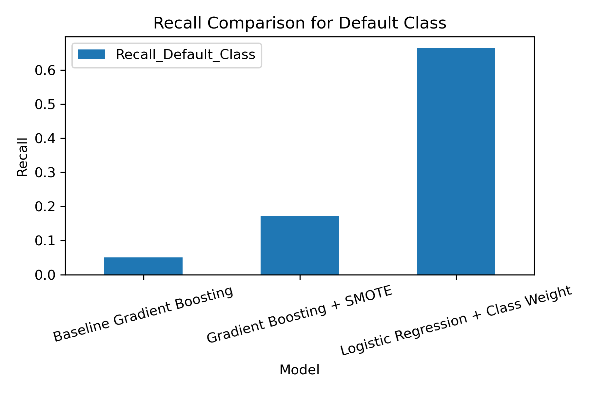
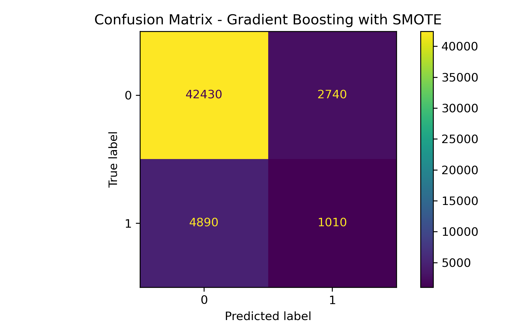

# loan-default-prediction-ml
Machine Learning models for predicting loan default using borrower financial attributes
# Loan Default Prediction using Machine Learning

This project applies machine learning techniques to predict loan default risk using borrower financial attributes.

## Models Used
- Logistic Regression
- Random Forest
- Gradient Boosting

## Dataset Features
- Age
- Income
- Credit Score
- Loan Amount
- Debt-to-Income Ratio
- Interest Rate

## Results
The Gradient Boosting model achieved the highest accuracy of approximately 88.7%.

## Project Structure
- notebooks/: Jupyter notebook with analysis
- data_sample/: sample dataset
- figures/: visualizations (ROC, feature importance, etc.)
- paper/: full research paper

## Tools Used
- Python
- Pandas
- Scikit-learn
- Matplotlib
## Project 2: Class Imbalance Study

This project investigates the effect of class imbalance handling techniques on loan default prediction.

### Techniques Used
- SMOTE
- Class Weighting

### Key Results
- Baseline Recall (Default Class): 0.05
- Gradient Boosting + SMOTE Recall: 0.17
- Logistic Regression + Class Weight Recall: 0.66

### Figures

#### Recall Comparison

#### Confusion Matrix

### Paper
[Download Paper 2](paper2/loan_default_class_imbalance_study.pdf)

# Loan Default Prediction using XGBoost with Class Imbalance Handling

## Overview
This project analyzes loan default prediction using machine learning, focusing on class imbalance challenges.

## Dataset
- 255,347 observations
- 11.6% default rate
- Imbalanced dataset (7.6:1 ratio)

## Models Used
- XGBoost
- XGBoost (Class Weighted)

## Results
| Model | Accuracy | Recall (Default) | AUC |
|------|--------|----------------|-----|
| XGBoost | 0.887 | 0.088 | 0.744 |
| Weighted XGBoost | 0.717 | 0.627 | 0.740 |

## Key Insight
Improving recall for default cases is more important than maximizing accuracy in financial risk modeling.

## Tools
- Python
- XGBoost
- Scikit-learn
